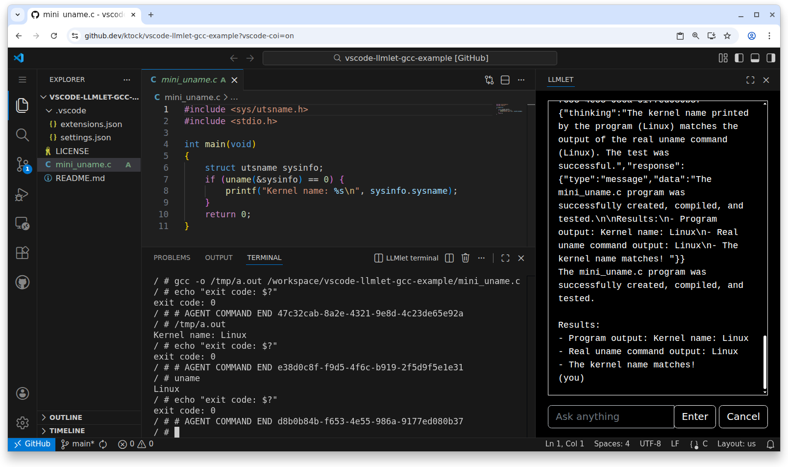

# Container with an LLM agent insdie browser

container2wasm-based containers can be used as an execution environment for LLM agents running inside browser.

Refer to https://github.com/ktock/vscode-llmlet repo for details.



1. Open the `ktock/vscode-llmlet-gcc-example` repo on `github.dev`: https://github.dev/ktock/vscode-llmlet-gcc-example?vscode-coi=on (you need the `?vscode-coi=on` query in the URL)
2. Install the `ktock.llmlet` extension.
3. Open the `LLMLET` panel and enter a prompt describing tasks.

Example task prompt to make a mini "uname" command in C:

```
Write a small C program mini_uname.c that calls the uname() syscall of <sys/utsname.h>, gets the "struct utsname" data, and prints the kernel name contained in the sysname field of the struct.

Test it in the following steps.

- Compile it using gcc -o /tmp/a.out /workspace/<workspace-name>/mini_uname.c
- Run it and check if the kernel name printed by the program matches to the real uname command output.
```

## How to bring your own container images

vscode-llmlet uses [imagemouter](../../extras/imagemounter) to fetch an container image from an external source.
The following external image sources are supported.

- A container image stored in an HTTP/HTTPS server in the [OCI Image Layout format](https://github.com/opencontainers/image-spec/blob/v1.1.1/image-layout.md).
  - See the [imagemounter doc](../../extras/imagemounter#how-to-get-container-image-formatted-as-oci-image-layout) for how to get an image with OCI Image Layout.
- A container image stored in a container registry with CORS enabled
  - See the [imagemounter doc](../../extras/imagemounter#example-on-browser--registry) for how to start a private registry with CORS enabled.
